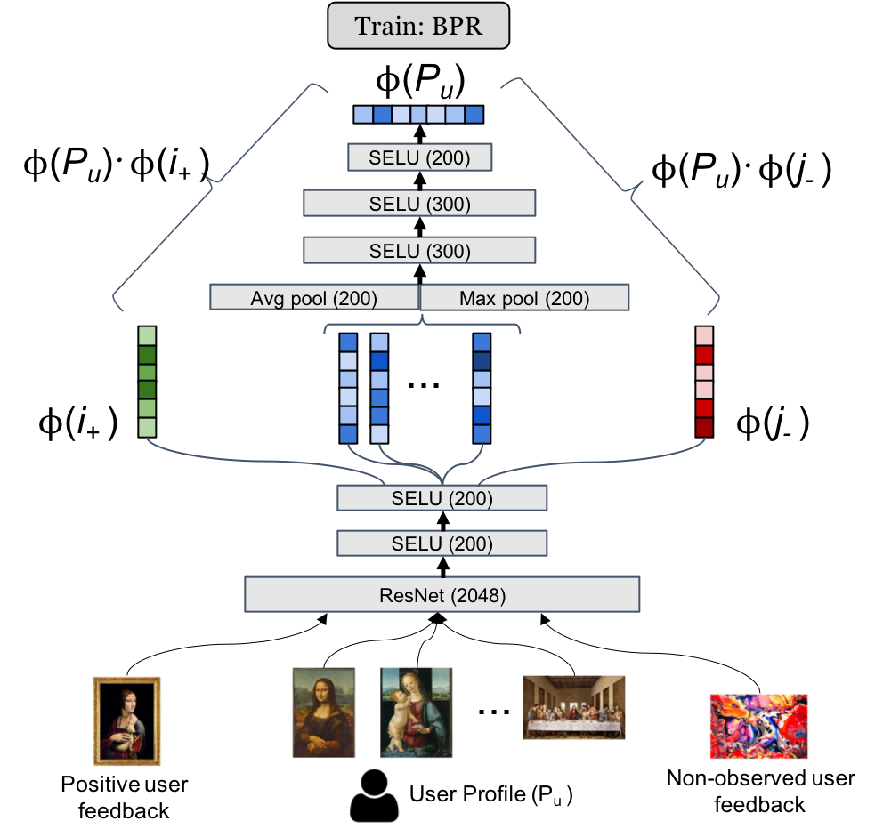

# CuratorNet experiments

This is part of the code that supports my master thesis. The idea is to reproduce the CuratorNet model and its data processing and evaluation procedures.

### Model architecture

> "CuratorNet (...) has a fixed set of parameters that only need to be trained once, and thereafter the model is able to generalize to new users or items never seen before, without further training. This is achieved by levaraging visual content: items are mapped to item vectores through visual embeddings, and users are mapped to user vectors by aggregating the visual content of items they have consumed."

## Data processing procedure

> "Besides the model architecture, we also introduce novel triplet sampling strategies to build a training set for rank learning in the art domain, resulting in a more effective learning than naive random sampling."

The training process is based on BPR, with truples of the form ($u$, $i_{-}$, $i_{+}$), where users are represented by a set of positive items. The data processing procedure two stages to create such triples: (1) creating visual clusters, and (2) sampling triples.

### Creating visual clusters

A pretrained network is used to create embedding vectors ($R^{2048}$), and then use PCA to reduce the dimensionality of images embedding vectors to $R^{200}$. More details about this procedure can be found in the paper.

### Sampling triples

Authors propose guidelines based in 6 strategies to generate robust training samples.

1. Predicting missing item in purchase basket.
2. Predicting next purchase basket.
3. Recommending visually similar artworks from favorite artists.
4. Recommending profile items from the same user profiel.
5. Recommending profile items given an artificially created user profile.
6. Artificial profile with a single item: recommend visually similar items from the same artist.

More details about this procedure and strategies can be found in the paper.

## Evaluation procedure

> "Before sampling the training and validation sets, we hide the last purchase basket of each user, as we use them later on for testing."

First of all, make sure that every user in the test set is present in the training set. Also, use tha last basket to calculate the average metrics for each user, and then calculate the global average.

## Current state of implementation

- [ ] Generating items embeddings with pretrained networks.
- [ ] Data processing procedure to create triples.
- [ ] Pytorch model architecture.
- [ ] Adapt framework to calculate metrics using hold-out.

