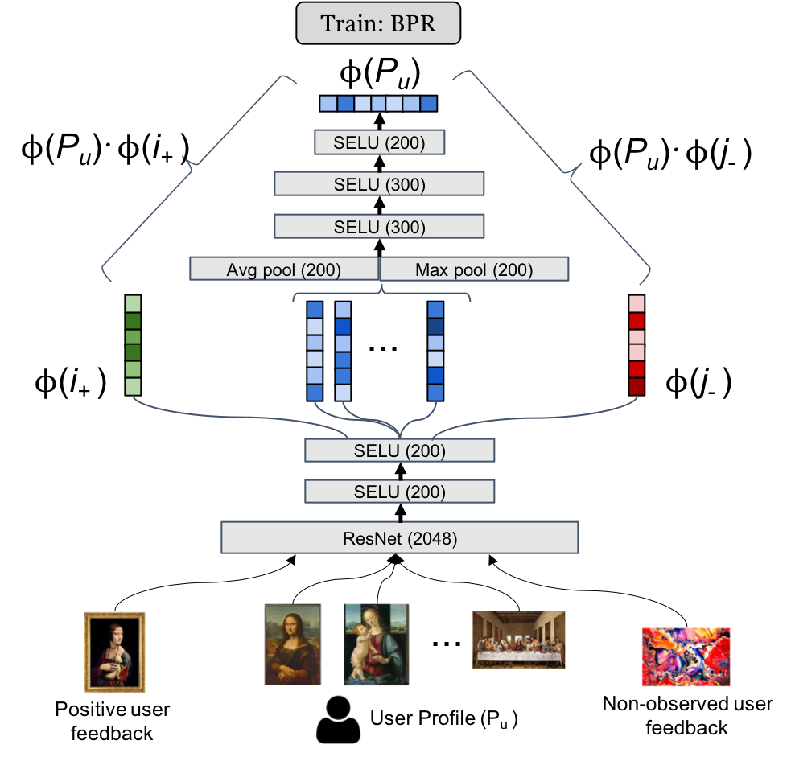
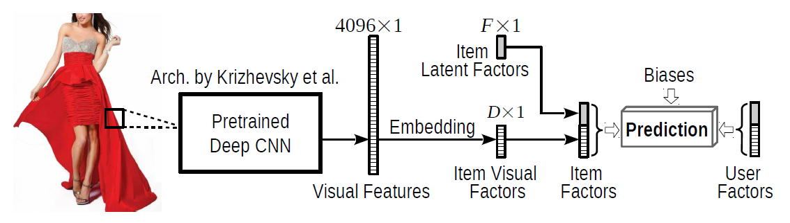

# Model experiments

This is part of the code that supports my master thesis. The idea is to implement state-of-the-art visual recommendation models and build a data processing and evaluation pipeline.

> This work is under review in a Web of Science journal, but the thesis is already publicly available and can be found in [my Google Scholar profile](https://scholar.google.com/citations?user=te1de2MAAAAJ).
>
> **Abstract**: In recommendation systems (RS), explanations are valuable due to the known benefits in user satisfaction, trustworthiness, and scrutability. However, most state-of-the-art RS learn user and item representations via matrix factorization or neural networks, which results in latent, accurate, but non-interpretable suggestions. For instance, Visually-aware recommendation systems rely on latent visual features obtained from pre-trained Deep Convolutional Neural Networks (DNNs), so they suffer from this problem. In this article we introduce a method for visually-aware recommendations which is both accurate and interpretable. To do this,  we leverage Network Dissection to extract interpretable visual features from pre-trained neural networks, we then train a model with these interpretable representations and adopt a feature attribution method to explain the recommendations. Our results show that our models trained using our approach perform similarly to a conventional latent-factors approach, but  with the additional ability to deliver personalized explanations. Also, the proposed method shows that it is possible to take advantage of existing "black box" systems and transform them into explainable systems by using appropriate item representations.

### Models architecture

#### CuratorNet

> CuratorNet: "CuratorNet (...) has a fixed set of parameters that only need to be trained once, and thereafter the model is able to generalize to new users or items never seen before, without further training. This is achieved by levaraging visual content: items are mapped to item vectores through visual embeddings, and users are mapped to user vectors by aggregating the visual content of items they have consumed." [1]

#### Visual Bayesian Personalized Ranking (VBPR)

> VBPR: "We proposed a scalable method that incorporates visual features extracted from product images into Matrix Factorization, in order to uncover the 'visual dimensions' that most influence people’s behavior. Our model is trained with Bayesian Personalized Ranking (BPR) using stochastic gradient ascent. Experimental results on multiple large real-world datasets demonstrate that we can significantly outperform state-of-the-art ranking techniques and alleviate cold start issues." [2]

## Data processing procedure

> CuratorNet: "Besides the model architecture, we also introduce novel triplet sampling strategies to build a training set for rank learning in the art domain, resulting in a more effective learning than naive random sampling."

The training process is based on BPR, with truples of the form ($u$, $i_{-}$, $i_{+}$), where users are represented by a set of positive items. The data processing procedure two stages to create such triples: (1) creating visual clusters, and (2) sampling triples.

### Creating visual clusters

PCA is applied to reduce the dimensionality of images embedding (be it a concept embedding from the proposed method or from a pretrained network) to $R^{200}$. Then K-means clustering is used to form visual groups and inform the sampling step. More details about this procedure can be found in the CuratorNet paper [1].

### Sampling triples

CuratorNet authors propose guidelines based in 6 strategies to generate robust training samples.

1. Predicting missing item in purchase basket.
2. Predicting next purchase basket.
3. Recommending visually similar artworks from favorite artists.
4. Recommending profile items from the same user profile.
5. Recommending profile items given an artificially created user profile.
6. Artificial profile with a single item: recommend visually similar items from the same artist.

More details about this procedure and strategies can be found in the CuratorNet paper [1].

## Evaluation procedure

> CuratorNet: "Before sampling the training and validation sets, we hide the last purchase basket of each user, as we use them later on for testing." [1]

First of all, make sure that every user in the test set is present in the training set. Also, use the last basket to calculate the average metrics for each user, and then calculate the global average.

### References

[1] Messina, P., Cartagena, M., Cerda, P., del Rio, F., & Parra,  D. (2020). CuratorNet: Visually-aware Recommendation of Art Images.  arXiv preprint arXiv:2009.04426.

[2] He, R., & McAuley, J. (2016). VBPR: visual bayesian  personalized ranking from implicit feedback. In Proceedings of the AAAI  Conference on Artificial Intelligence (Vol. 30, No. 1).

---

Additional resources related to this work:

* [Code: aaossa/NetDissect-experiments](https://github.com/aaossa/NetDissect-experiments):  Experiments related to using NetDissect as a local explanator
* [Code: aaossa/Model-experiments](https://github.com/aaossa/Model-experiments): This repository
* [Code: aaossa/Concept-experiments](https://github.com/aaossa/Concept-experiments): Experiments related to creating a recommendation and explanation interface

More resources:

* Poster @ LatinX in CV workshop @ ICCV 21': Poster **"Explainable neural image recommendation using Network Dissection visual concepts"**, presented at the LatinX in Computer Vision Workshop at the 2021 IEEE International Conference on Compter Vision (IEEE ICCV 2021) [[poster](https://drive.google.com/file/d/1on1lkVigCPGmIXjJg5ZzT-DCxmn4XQ8l/view?usp=sharing)]
* Tutorial @ IUI 21': Tutorial on **"VisRec: A Hands-on Tutorial on Deep Learning for Visual Recommender Systems"** ([https://doi.org/10.1145/3397482.3450620](https://doi.org/10.1145/3397482.3450620)), presented at the 2021 ACM Conference on Intelligent User Interfaces (ACM IUI 2021) [[website](https://github.com/ialab-puc/VisualRecSys-Tutorial-IUI2021), [doi](https://doi.org/10.1145/3397482.3450620), [video](https://drive.google.com/file/d/1HfCs-9PgKwV5XEDMTEo-bMDrp4R9lc4p/view?usp=sharing)]
* Tutorial @ ICDM 21': Another tutorial, **"A Tutorial on Wikimedia Visual Resources and its Application to Neural Visual Recommender Systems"**, presented at the 21st IEEE International Conference on Data Mining (IEEE ICDM 2021). To be held on December, 2021. [[website](https://github.com/ialab-puc/VisualRecSys-Tutorial-ICDM2021)]

